  

### 💻 Language Stats

  
  
  

---

## 📊 About Me

<!--
- 🔭 I'm currently working on ...
- 🌱 I'm currently learning ...
- 👯 I'm looking to collaborate on ...
- 🤔 I'm looking for help with ...
- 💬 Ask me about ...
- 📫 How to reach me: ...
- 😄 Pronouns: ...
- ⚡ Fun fact: ...
-->

  
  ### 🛠️ Tech Stack
  
  
  
  
  
  
  

---

  
  ### 📈 GitHub Activity
  
  
  

---

  
  ### 🏆 GitHub Trophies
  
  
  

---

<!-- 

  
  ### 📝 Latest Blog Posts
  
  <!-- BLOG-POST-LIST:START -->
  <!-- BLOG-POST-LIST:END -->
  

 -->

---

  
  ### 🤝 Connect with me
  
  
  
  
  

---

  
  
  
  
  

---

## 📌 Note

言語統計は [repo-spector](https://github.com/4okimi7uki/repo-spector) を使用して生成しています。GitHub Actionsで毎週月曜日に自動更新されます。
